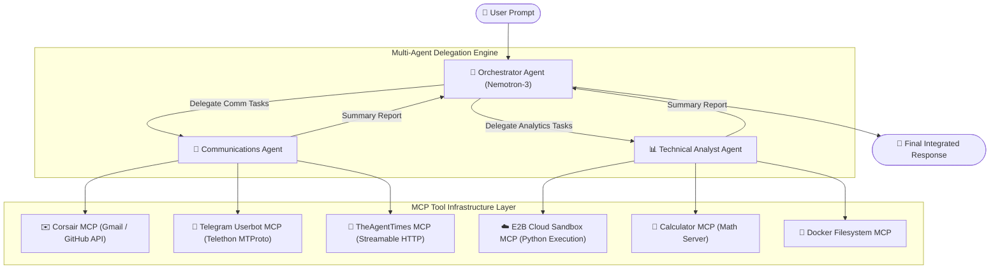

# 🤖 Enterprise Multi-Agent MCP Orchestration Engine

[](https://www.python.org/)
[](https://modelcontextprotocol.io/)
[](https://build.nvidia.com/)
[](https://e2b.dev/)
[](https://telethon.dev/)

> **An extensible Multi-Agent AI system powered by NVIDIA Nemotron-3 LLM and the Model Context Protocol (MCP), built with production-grade patterns. Features Orchestrator-Worker delegation, secure cloud sandboxing, dynamic skill playbook injection, and real-time automated communications.**

---

## 🚀 Executive Summary

Modern AI applications often struggle with **monolithic context bloat** and **tool over-permissioning** when single-agent systems are given access to dozens of API tools at once. 

This project addresses these limitations by implementing an **Orchestrator-Worker Multi-Agent System with production-grade architectural patterns** driven by the **Model Context Protocol (MCP)** standard. 

### Why This Project Stands Out (Recruiter Highlights):
- **🔒 Least-Privilege Sub-Agent Scoping**: Specialized sub-agents only receive context and tool access required for their domain, eliminating unintended side-effects and context window overflow.
- **⚡ Async MCP Infrastructure**: Simultaneous stdio & streamable HTTP connection transport management across 5 distinct tool microservices.
- **☁️ Remote Sandboxed Execution**: Secure Python and Bash code evaluation inside persistent, isolated E2B cloud containers.
- **📜 Dynamic Playbook/Skill Ingestion**: Ability to read markdown skill playbooks with YAML frontmatter to dynamically adapt agent operational guidelines at runtime.
- **📲 Direct Personal Account Automation**: Integrated MTProto Telegram Userbot API (Telethon) for native account automation without standard bot restrictions.

---

## 🏗️ System Architecture

The project employs an **Orchestrator-Worker Pattern** where a central Router Agent analyzes incoming natural language tasks, breaks them down into sub-goals, and delegates execution to specialized worker agents.



---

## ✨ Key Features & Technical Capabilities

### 1. 👑 Orchestrator-Worker Multi-Agent Engine ([`multi_agent.py`](file:///home/maheshn/project/simpleAgent/multi_agent.py))
- **Meta-Tool Delegation**: The central Orchestrator model does not directly execute raw tools. Instead, it holds meta-tools (`delegate_to_communications_agent`, `delegate_to_analyst_agent`).
- **Context Compression**: Worker agents execute multi-step tool calls locally and return synthesized summary reports back to the Orchestrator, keeping the master context window lean and focused.

### 2. ☁️ E2B Cloud Code Interpreter Sandbox ([`E2B_sandbox.py`](file:///home/maheshn/project/simpleAgent/E2B_sandbox.py))
- **Remote Execution**: Executes raw Python blocks and terminal Bash commands in a cloud-hosted, isolated container via FastMCP.
- **File Persistence**: Supports writing, reading, and inspecting remote sandbox file systems for heavy computational tasks, data analysis, or script generation.

### 3. 📱 Telegram MTProto Personal Account Userbot ([`telegarm_mcp.py`](file:///home/maheshn/project/simpleAgent/telegarm_mcp.py))
- **Beyond Bot API**: Bypasses standard Telegram bot constraints (`/start` requirement, restricted group visibility) by authenticating as a full MTProto personal user account using **Telethon**.
- **Dynamic Telethon Execution**: Evaluates asynchronous Telethon Python code snippets on demand for querying dialogs, reading pinned folders, and initiating direct messaging.

### 4. 📜 Dynamic Skill & Playbook Engine ([`index.py`](file:///home/maheshn/project/simpleAgent/index.py) & [`skill.md`](file:///home/maheshn/project/simpleAgent/skill.md))
- **Runtime Adaptation**: Parses custom markdown playbooks with YAML metadata (`name`, `description`).
- **Prompt Injection**: Automatically formats skill guidelines into system prompts, enabling domain-specific constraints (e.g., isolation rules, news summarization standards) without retraining or modifying code.

### 5. 🛠️ Corsair & Multi-Domain Integrations ([`corsair-server`](file:///home/maheshn/project/simpleAgent/corsair-server))
- Node.js TSX server exposing Gmail and GitHub API capabilities directly to the agent framework via MCP stdio transport.

---

## 🛠️ Technology Stack

| Layer | Technology | Purpose & Usage |
| :--- | :--- | :--- |
| **LLM Provider** | NVIDIA Nemotron (`nemotron-3-ultra-550b-a55b`) | Core reasoning, tool function selection, and text synthesis |
| **Agent Protocol** | Model Context Protocol (`mcp` SDK) | Unified tool connection protocol over stdio and HTTP streams |
| **Cloud Sandbox** | E2B Code Interpreter (`e2b-code-interpreter`) | Isolated remote container execution for Python & shell scripts |
| **Telegram Protocol** | Telethon (Python MTProto library) | Native personal Telegram account control & messaging |
| **Containerization** | Docker (`ghcr.io/mark3labs/mcp-filesystem-server`) | Local containerized filesystem isolation |
| **Runtime & Tooling**| Python 3.12, `uv`, Node.js, `tsx` | Async runtime environment & multi-language MCP server management |

---

## 📁 Codebase Structure

```text
simpleAgent/
├── 📄 multi_agent.py            # Master Orchestrator-Worker Multi-Agent System implementation
├── 📄 index.py                  # Single-agent runtime with dynamic Skill Playbook injection
├── 📄 E2B_sandbox.py            # FastMCP server wrapping E2B Cloud Sandboxed Code Interpreter
├── 📄 telegarm_mcp.py           # FastMCP server wrapping Telethon MTProto Telegram Userbot
├── 📄 server.py                 # FastMCP lightweight calculation engine
├── 📄 corsair_mcp.py            # MCP Stdio connection configuration for Corsair server
├── 📄 skill.md                  # Operational Playbook with YAML frontmatter & rule sets
├── 📄 multi_agent_guide.md      # Comprehensive architecture guide for Multi-Agent systems
├── 📄 personal_telegram_guide.md# Guide for MTProto Userbot setup & credential acquisition
├── 📁 corsair-server/           # Node.js TypeScript server for Gmail & GitHub MCP tool APIs
├── 📄 pyproject.toml            # Python dependencies and project configuration
└── 📄 .env                      # API Keys and authentication credentials (git-ignored)
```

---

## ⚡ Quickstart & Setup Guide

### 1. Prerequisites
- **Python 3.12+** & **`uv`** package manager installed.
- **Node.js (v18+)** and `npx` installed.
- **Docker** running (if using local containerized filesystem server).

### 2. Environment Configuration
Create a `.env` file in the root directory with your credentials:
```env
nemotron_api_key="your_nvidia_nemotron_api_key"
smithery_api_key="your_smithery_api_key"
E2B_API_KEY="your_e2b_api_key"
TELEGRAM_API_ID=123456
TELEGRAM_API_HASH="your_telegram_api_hash"
TELEGRAM_PHONE="+1234567890"
```

### 3. Install Dependencies
```bash
# Install Python dependencies using uv
uv sync
```

### 4. Interactive Telegram Login (One-Time Session Initialization)
To generate the local Telethon userbot session:
```bash
.venv/bin/python telegarm_mcp.py login
```
*Enter the OTP sent to your Telegram client when prompted.*

### 5. Running the Multi-Agent Engine
Execute the complete Orchestrator-Worker multi-agent workflow:
```bash
.venv/bin/python multi_agent.py
```

### 6. Running the Skill-Adapted Engine
Execute the single-agent pipeline guided by [`skill.md`](file:///home/maheshn/project/simpleAgent/skill.md):
```bash
.venv/bin/python index.py
```

---

## 🎯 Sample Workflow Execution

When a user submits a complex cross-domain query:

> *"Run a Python script in E2B sandbox to calculate the first 10 Fibonacci numbers, write the results to 'fib.txt' in the sandbox, read the file, and send the output to my Telegram account."*

1. 👑 **Orchestrator** analyzes the prompt and delegates sandbox/file tasks to the **Analyst Agent**.
2. 📊 **Analyst Agent** connects to `E2B-Sandbox`, executes the Python calculation, writes `fib.txt`, reads it, and reports back the exact result.
3. 👑 **Orchestrator** receives the report and delegates the messaging task to the **Communications Agent**.
4. 💬 **Communications Agent** invokes `TelegramUserbot`, executes asynchronous MTProto messaging, sends the content, and reports success.
5. 👑 **Orchestrator** combines both reports into a clean final response for the user.

---

## 👨‍💻 Developer Profile & Key Engineering Takeaways

This project showcases expertise in:
- **Agentic AI Architecture**: Designing production-grade multi-agent frameworks beyond simple single-prompt implementations.
- **Protocol Standardization**: Leveraging **MCP (Model Context Protocol)** for scalable tool interoperability across Python, Node.js, Cloud APIs, and Docker containers.
- **Asynchronous Python & Distributed Systems**: Managing complex event loops (`asyncio`) and multi-process subprocess streams.
- **Security Engineering**: Sandboxing runtime code execution and enforcing least-privilege tool access boundaries.

---
*Created by [Mahesh N](https://github.com/)*
