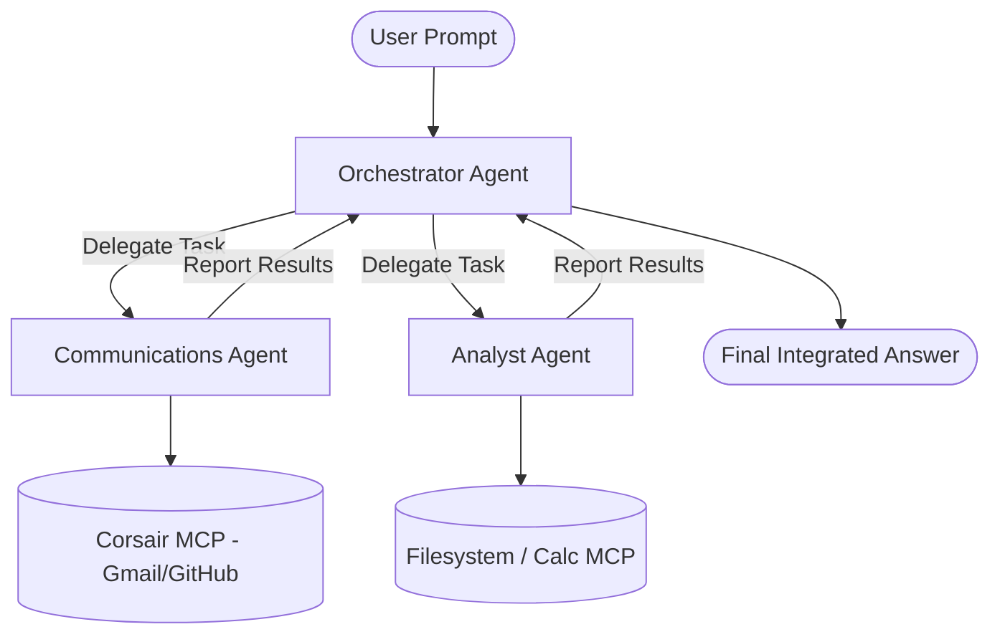

# Guide: Implementing a Multi-Agent System with MCP

This guide explains how to convert a single-agent system (which has access to all tools at once) into a specialized **Multi-Agent System** using the **Orchestrator-Worker Pattern**.

---

## 1. The Architecture: Orchestrator-Worker Pattern

In this architecture, responsibilities are split:
1. **Orchestrator (Router)**: Receives the user request, breaks it down, and delegates sub-tasks to specialized sub-agents. It has **no direct access to MCP tools**—only to the sub-agents.
2. **Communications Agent (Worker)**: Has access **only** to Corsair tools (Gmail/GitHub) and a system prompt focused on communication.
3. **Technical Analyst Agent (Worker)**: Has access **only** to Filesystem and Calculator tools and a system prompt focused on data analytics.



---

## 2. Refactoring Your Code (`index.py`)

Here is a practical template of how you can implement this structure in Python:

```python
import os
import json
import asyncio
from openai import OpenAI

client = OpenAI(
    base_url="https://integrate.api.nvidia.com/v1",
    api_key=os.getenv("nemotron_api_key")
)

# Helper function to get tools from a specific session
def get_tools_for_session(session):
    # Retrieve and format only the tools belonging to this session
    pass

# Helper to run a tool execution loop for an agent
async def run_agent_loop(messages, tools, sessions):
    # Standard agent while loop to execute tool calls
    pass

# ==================================================
# 1. DEFINE WORKER AGENTS
# ==================================================

async def run_communications_agent(task, corsair_session):
    """Specialized Agent for Emails & GitHub"""
    print(f"🤖 [CommAgent] Starting task: '{task}'")
    
    # Filter tools to only include Gmail and GitHub
    github_gmail_tools = get_tools_for_session(corsair_session)
    
    messages = [
        {
            "role": "system", 
            "content": (
                "You are a Communication Specialist. You excel at reading/writing emails "
                "and managing GitHub. Use your tools to perform the task and return a clean summary."
            )
        },
        {"role": "user", "content": task}
    ]
    
    result = await run_agent_loop(messages, github_gmail_tools, [corsair_session])
    return result


async def run_analyst_agent(task, fs_session, calc_session):
    """Specialized Agent for local filesystem and calculations"""
    print(f"🤖 [AnalystAgent] Starting task: '{task}'")
    
    # Filter tools to only include local filesystem and calculator
    local_tools = get_tools_for_session(fs_session) + get_tools_for_session(calc_session)
    
    messages = [
        {
            "role": "system", 
            "content": (
                "You are a Technical Analyst. You read/write local files and perform "
                "mathematical calculations. Use your tools to execute the task."
            )
        },
        {"role": "user", "content": task}
    ]
    
    result = await run_agent_loop(messages, local_tools, [fs_session, calc_session])
    return result


# ==================================================
# 2. DEFINE THE ORCHESTRATOR
# ==================================================

async def run_orchestrator(user_query, fs_session, calc_session, corsair_session):
    print(f"👑 [Orchestrator] Received Query: '{user_query}'")
    
    # The Orchestrator has access to NO MCP tools directly.
    # It only has access to "meta-tools" to delegate tasks to workers.
    orchestrator_tools = [
        {
            "type": "function",
            "function": {
                "name": "delegate_to_communications_agent",
                "description": "Send a task to the Gmail and GitHub specialist.",
                "parameters": {
                    "type": "object",
                    "properties": {"task": {"type": "string"}},
                    "required": ["task"]
                }
            }
        },
        {
            "type": "function",
            "function": {
                "name": "delegate_to_analyst_agent",
                "description": "Send a task to the Local Filesystem and Calculator analyst.",
                "parameters": {
                    "type": "object",
                    "properties": {"task": {"type": "string"}},
                    "required": ["task"]
                }
            }
        }
    ]
    
    messages = [
        {
            "role": "system", 
            "content": (
                "You are the Lead Coordinator (Orchestrator). Your job is to break down "
                "the user's query and delegate tasks to specialized sub-agents. Once workers "
                "return results, integrate them into a final answer for the user."
            )
        },
        {"role": "user", "content": user_query}
    ]
    
    while True:
        response = client.chat.completions.create(
            model="nvidia/nemotron-3-ultra-550b-a55b",
            messages=messages,
            tools=orchestrator_tools,
            temperature=0.2
        )
        message = response.choices[0].message
        messages.append(message)
        
        if message.tool_calls:
            for tool_call in message.tool_calls:
                tool_name = tool_call.function.name
                args = json.loads(tool_call.function.arguments)
                
                if tool_name == "delegate_to_communications_agent":
                    # Call the specialized sub-agent
                    agent_result = await run_communications_agent(args["task"], corsair_session)
                    
                elif tool_name == "delegate_to_analyst_agent":
                    # Call the other sub-agent
                    agent_result = await run_analyst_agent(args["task"], fs_session, calc_session)
                
                # Feed the agent's report back to the Orchestrator
                messages.append({
                    "role": "tool",
                    "tool_call_id": tool_call.id,
                    "content": agent_result
                })
        else:
            print("\n👑 [Orchestrator] Final Combined Response:")
            print(message.content)
            break
```

---

## 3. Benefits of this Architecture

1. **Modular Scope**: Sub-agents only see the tools relevant to them. The Gmail specialist will never try to execute a local file shell script.
2. **Context Compression**: Instead of pasting massive API outputs and files into the main conversation history, workers execute locally, summarize the results, and return only the clean reports to the Orchestrator.
3. **Task Division**: The Orchestrator can split a single query (e.g. *"read logs.txt, average the latency column, and email it to my team"*) into two distinct sequentially chained agent calls.
